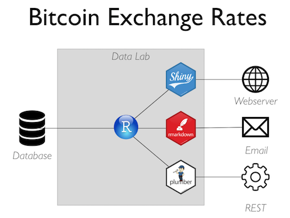

# Bitcoin Demo

This files demonstrate how to use R in a production environment.

### Files

1. ETL. Extract, transform, and load bitcoin data from a web API into the PostgreSQL database.
2. App. Build a Shiny app that depends on the database.
3. HTML. Embed the Shiny app into a website.
4. Report. Render and email custom reports on demand and on a schedule.
5. API. Create an API for other systems to call.

### Content generated

1. Shiny. Host a shiny app that can scale to thousands of end users.
2. Parameterized R Markdown. Create a report that can handle end user inputs.
3. Plumber API. Host a scalable API with multiple endpoints and serializers.

### Integration points

1. Web server. Embed Shiny applications with an iframe tag.
2. Email. Send reports via email.
3. API call. Call a REST API from the browser.

