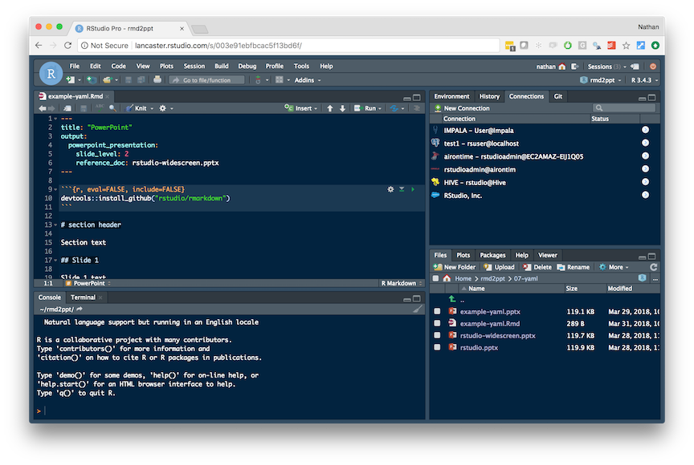
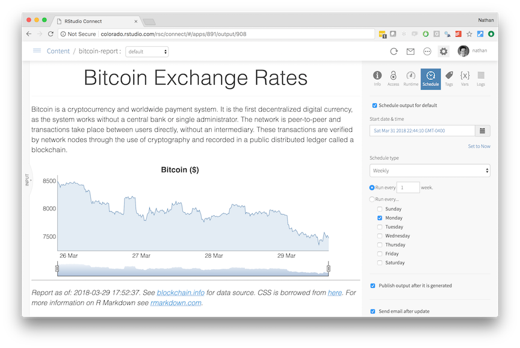
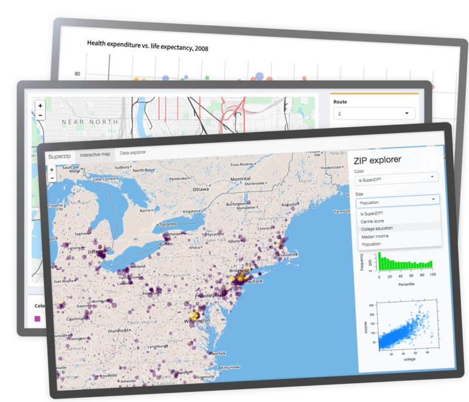
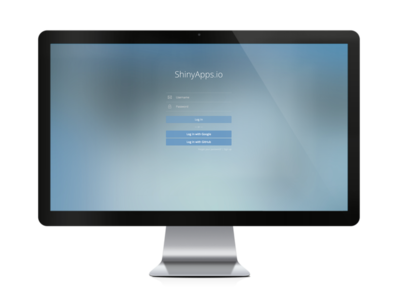
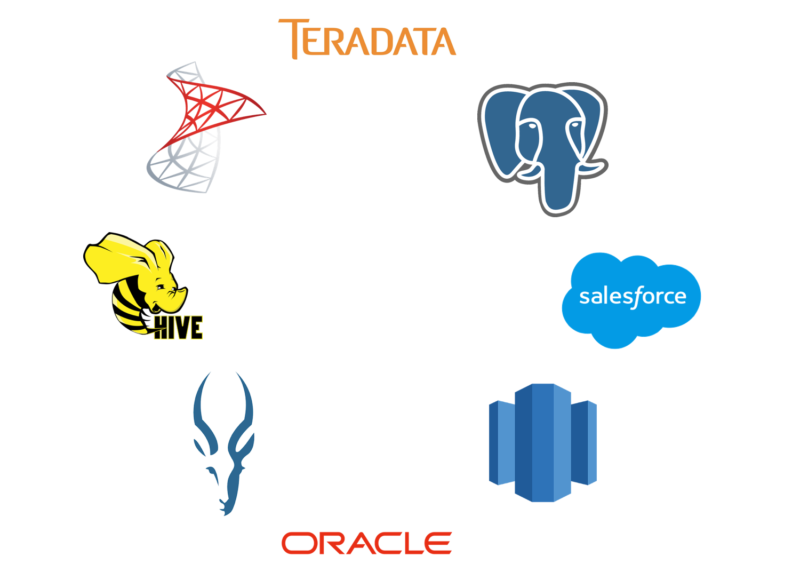

[](https://www.rstudio.com/)

<hr>

### RStudio Server Pro

*RStudio is the premier IDE for R. RStudio Server lets you access RStudio from anywhere using a web browser. [RStudio Server Pro](https://www.rstudio.com/products/rstudio-server-pro/) delivers the team productivity, security, centralized management, metrics, and commercial support that professional data science teams need to develop at scale.*

[](http://docs.rstudio.com/ide/server-pro/)

[**RStudio Server Professional Edition Administration Guide** [Current]](http://docs.rstudio.com/ide/server-pro/)


```{r, echo=FALSE}

version_rsp <- c("1.1.442", "1.1.423", "1.1.419", "1.1.414", "1.1.383", "1.0.153",
                 "1.0.143", "1.0.136", "1.0.44", "0.99.903", "0.99.902", "0.99.896",
                 "0.99.893", "0.99.892", "0.99.891")

inputPanel(selectInput("version_rsp", label = "Older Versions", choices = version_rsp))

# http://docs.rstudio.com/ide/server-pro/1.1.442	
# http://docs.rstudio.com/ide/server-pro/1.1.442/rstudio-server-pro-1.1.442-admin-guide.pdf	
# http://docs.rstudio.com/ide/server-pro/1.1.442/rstudio-server-pro-1.1.442-admin-guide.epub
# http://docs.rstudio.com/ide/server-pro/1.1.442/rstudio-server-pro-1.1.442-admin-guide.mobi

path_rsp <- function(version, ...){
  x1 <- "http://docs.rstudio.com/ide/server-pro/"
  x2 <- "/rstudio-server-pro-"
  x3 <- "-admin-guide"
  if(missing(...)){
    paste0(x1, version)
  } else {
    paste0(x1, version, x2, version, x3, ...)
  }
}

renderUI({
  v <- input$version_rsp
  tagList(
    tags$a(href = path_rsp(v), "HTML"),
    tags$em(" | "),
    tags$a(href = path_rsp(v, ".pdf"), "PDF"),
    tags$em(" | "),
    tags$a(href = path_rsp(v, ".epub"), "EPUB"),
    tags$em(" | "),
    tags$a(href = path_rsp(v, ".mobi"), "MOBI"),
    tags$hr()
  )
})
```


### RStudio Connect

*[RStudio Connect](https://www.rstudio.com/products/connect/) is a new publishing platform for the work your teams create in R. Share Shiny applications, R Markdown reports, Plumber APIs, dashboards, plots, and more in one convenient place. Use push-button publishing from the RStudio IDE, scheduled execution of reports, and flexible security policies to bring the power of data science to your entire enterprise.*

[](http://docs.rstudio.com/connect/admin/)

[**RStudio Connect: Admin Guide** [Current]](http://docs.rstudio.com/connect/admin/)


```{r, echo=FALSE}

fullversion_rsc <- c("1.5.14-6", "1.5.12.1-10", "1.5.12-7", "1.5.10-6", "1.5.8-12", "1.5.6.2-13", 
                     "1.5.6.1-9", "1.5.6-7", "1.5.4-13", "1.5.2-25", "1.5.0-8", "1.4.6-11", "1.4.4.1-16", 
                     "1.4.4-4", "1.4.2-15", "1.4.0-18", "1.2.1-28", "1.2.0-22")

fullversion_rsc <- strsplit(fullversion_rsc, "-")
version_rsc <- sapply(fullversion_rsc, function(x) x[1])
subversion_rsc <- sapply(fullversion_rsc, function(x) x[2])

inputPanel(selectInput("version_rsc", label = "Older Versions", choices = version_rsc))

# http://docs.rstudio.com/connect/1.5.14/admin/
# http://docs.rstudio.com/connect/1.5.14/admin/rstudio-connect-admin-guide-1.5.14-6.pdf

path_rsc <- function(version, ...){
  if(version == "Current") version <- NULL
  x1 <- "http://docs.rstudio.com/connect/"
  x2 <- "/admin/"
  x3 <- "rstudio-connect-admin-guide-"
  if(missing(...)){
    paste0(x1, version, x2)
  } else {
    paste0(x1, version, x2, x3, version, ...)
  }
}

renderUI({
  v <- input$version_rsc
  tagList(
    tags$a(href = path_rsc(v), "HTML"),
    tags$em(" | "),
    tags$a(href = path_rsc(v, "-", subversion_rsc[match(v, version_rsc)], ".pdf"), "PDF"),
    tags$hr()
  )
})
```


### Shiny Server Pro

*Shiny combines the computational power of R with the interactivity of the modern web. Professional data science teams choose [Shiny Server Pro](https://www.rstudio.com/products/shiny-server-pro/) to share their shiny applications, secure user access, tune performance, monitor resource utilization and get the direct support they need to create the best interactive data experiences for their customers and colleagues.*

[](http://docs.rstudio.com/shiny-server/)

[**Shiny Server Professional Administrator's Guide** [Current]](http://docs.rstudio.com/shiny-server/)


```{r, echo=FALSE}

version_ssp <- c("1.5.6", "1.5.5", "1.5.4", "1.5.3", "1.5.2", "1.5.1", "1.5.0", "1.4.7")

inputPanel(selectInput("version_ssp", label = "Older Versions", choices = version_ssp))

# http://docs.rstudio.com/shiny-server/1.5.6

renderUI({
  v <- input$version_ssp
  tagList(
    tags$a(href = paste0("http://docs.rstudio.com/shiny-server/", v), "HTML"),
    tags$hr()
  )
})
```


### RStudio Package Manager

*[RStudio Package Manager](https://www.rstudio.com/products/package-manager/) is a new repository management server for R packages. Get offline access to CRAN, automate CRAN syncs, share local packages, restrict package access, find packages across repositories, and more. Experience reliable and consistent package management, optimized for teams who use R.*

[](http://docs.rstudio.com/rspm/admin/)

[**RStudio Package Manager: Admin Guide** [Current]](http://docs.rstudio.com/rspm/admin/)


```{r, echo=FALSE}

fullversion_rspm <- c("0.3.0-4", "0.2.0-10", "0.1.0-5")

fullversion_rspm <- strsplit(fullversion_rspm, "-")
version_rspm <- sapply(fullversion_rspm, function(x) x[1])
subversion_rspm <- sapply(fullversion_rspm, function(x) x[2])

inputPanel(selectInput("version_rspm", label = "Older Versions", choices = version_rspm))

# http://docs.rstudio.com/rspm/0.3.0/admin/
# http://docs.rstudio.com/rspm/admin/rstudio-pm-admin-guide-0.3.0-4.pdf

path_rspm <- function(version, ...){
  x1 <- "http://docs.rstudio.com/rspm/"
  x2 <- "/admin/"
  x3 <- "rstudio-pm-admin-guide-"
  if(missing(...)){
    paste0(x1, version, x2)
  } else {
    paste0(x1, version, x2, x3, version, ...)
  }
}

renderUI({
  v <- input$version_rspm
  tagList(
    tags$a(href = path_rspm(v), "HTML"),
    tags$em(" | "),
    tags$a(href = path_rspm(v, "-", subversion_rspm[match(v, version_rspm)], ".pdf"), "PDF"),
    tags$hr()
  )
})

```

### Shinyapps.io

*Share your Shiny apps online. Deploy your Shiny applications online in minutes with [shinyapps.io](https://www.rstudio.com/products/shinyapps/).*

[](http://docs.rstudio.com/shinyapps.io/)

[**Shinyapps.io User Guide**](http://docs.rstudio.com/shinyapps.io/)

<hr>

### RStudio Professional Drivers

*RStudio makes it easy to access and analyze your data with R. [RStudio Professional Drivers](https://support.rstudio.com/hc/en-us/articles/115011761688-Getting-Started-with-RStudio-Professional-Drivers) are ODBC data connectors that help you connect to some of the most popular databases.*

[](https://support.rstudio.com/hc/en-us/articles/115011761688-Getting-Started-with-RStudio-Professional-Drivers)

[**Getting Started with RStudio Professional Drivers**](https://support.rstudio.com/hc/en-us/articles/115011761688-Getting-Started-with-RStudio-Professional-Drivers)

<hr>

### Websites

*RStudio maintains many subdomains that describe how to use specific packages.*

* [Shiny](http://shiny.rstudio.com/)
* [R Markdown](https://rmarkdown.rstudio.com/)
* [The Tidyverse](https://www.tidyverse.org/)
* [Spark](http://spark.rstudio.com/)
* [Databases](http://db.rstudio.com/)
* [TensorFlow](https://tensorflow.rstudio.com/)
* [Keras](https://keras.rstudio.com/)
* [Flexdashboard](https://rmarkdown.rstudio.com/flexdashboard/index.html)

<hr>

### Articles {.tabset}

*[R Views](https://rviews.rstudio.com/) is a community blog edited by RStudio. The following articles are part of the category: [R for the Enterprise](https://rviews.rstudio.com/categories/r-for-the-enterprise/).*

#### Data Lab

* [Make R a Legitimate Part of Your Organization](https://rviews.rstudio.com/2016/11/16/make-r-a-legitimate-part-of-your-organization/)
* [Analytics Administration for R](https://rviews.rstudio.com/2017/06/21/analytics-administration-for-r/)
* [A Data Science Lab for R](https://rviews.rstudio.com/2017/12/20/rstudio-server-quick-start/)
* [Multiple Versions of R](https://rviews.rstudio.com/2018/03/21/multiple-versions-of-r/)
* [Understanding R's Startup](https://rviews.rstudio.com/2017/04/19/r-for-enterprise-understanding-r-s-startup/)

<hr>

#### Databases

* [Databases Using R](https://rviews.rstudio.com/2017/05/17/databases-using-r/)
* [Visualizations with R and Databases](https://rviews.rstudio.com/2017/08/16/visualizations-with-r-and-databases/)
* [Enterprise Ready Dashboards with Shiny and Databases](https://rviews.rstudio.com/2017/09/20/dashboards-with-r-and-databases/)
* [Database Queries with R](https://rviews.rstudio.com/2017/10/18/database-queries-with-r/)
* [How to Scale Your Analytics Using R](https://rviews.rstudio.com/2016/12/21/r-for-enterprise-how-to-scale-your-analytics-using-r/)

<hr>

#### Packages

* [Some Ideas for Your Internal R Packages](https://rviews.rstudio.com/2017/07/19/supporting-corporate-r-user-groups/)
* [Package Management and Reproducible R Code](https://rviews.rstudio.com/2018/01/18/package-management-for-reproducible-r-code/)

<hr>

#### Content

* [R Markdown for the Enterprise](https://rviews.rstudio.com/2017/01/25/r-markdown-for-the-enterprise/)
* [Using Shiny with Scheduled and Streaming Data](https://rviews.rstudio.com/2017/11/15/shiny-and-scheduled-data-r/)
* [Deep Learning at rstudio::conf 2018](https://rviews.rstudio.com/2018/02/14/deep-learning-rstudio-conf-2018/)

<hr>

### Webinars {.tabset}

*[RStudio webinars](https://www.rstudio.com/resources/webinars/) and videos are presented on a variety of subjects. [Archives](https://www.rstudio.com/resources/webinars/) and associated [materials](https://github.com/rstudio/webinars) can be found online.*

#### RStudio

* [Administering RStudio Server Pro](https://www.rstudio.com/resources/webinars/administering-rstudio-server-pro/)
* [RStudio Server Pro 1.1 New Features](https://www.rstudio.com/resources/videos/rstudio-server-pro-1-1-new-features/)

<hr>

#### Connect

* [Administration of RStudio Connect in Production](https://www.rstudio.com/resources/webinars/administration-of-rstudio-connect-in-production/)
* [The Tidyverse and RStudio Connect](https://www.rstudio.com/resources/webinars/the-tidyverse-and-rstudio-connect/)
* [RStudio Connect Internals - The Basics](https://www.rstudio.com/resources/webinars/rstudio-connect-internals-the-basics/)

<hr>

#### Shiny

* [Administering Shiny Server Pro](https://www.rstudio.com/resources/webinars/administering-shiny-server-pro/)
* [Scaling Shiny](https://www.rstudio.com/resources/videos/scaling-shiny/)

<hr>

#### Data Science

* [The R Admin](https://www.rstudio.com/resources/videos/the-r-admin-is-rad-a-guide-to-professional-r-tooling-and-integration/)
* [Best Practices for working with R and Databases](https://www.rstudio.com/resources/videos/best-practices-for-working-with-databases-webinar/)

<hr>

#### Spark

* [Introducing an R Interface for Apache Spark](https://www.rstudio.com/resources/webinars/introducing-an-r-interface-for-apache-spark/)
* [Extending Spark Using Sparklyr and R](https://www.rstudio.com/resources/webinars/extending-spark-using-sparklyr-and-r/)
* [Advanced Features of Sparklyr](https://www.rstudio.com/resources/webinars/advanced-features-of-sparklyr/)
* [Understanding Sparklyr Deployment Modes](https://www.rstudio.com/resources/webinars/understanding-sparklyr-deployment-modes/)

<hr>

### References

*Additional references can be found here:*

* [RStudio EULA](https://www.rstudio.com/about/eula/)
* [Platform deprecation strategy](https://www.rstudio.com/about/platform-deprecation-strategy/)
* [Who we are and what we do](https://www.rstudio.com/about/#cf0e2a85345e0767f)
* [Why are people so excited about R?](http://colorado.rstudio.com:3939/content/1012/excited-about-R.html)

<hr>

### Support

*RStudio has a mission to provide the most widely used open source and enterprise-ready professional software for the R statistical computing environment. We offer open source and enterprise ready tools for the R computing environment. For professional support help, please contact support@rstudio.com* 

* [RStudio Support](https://support.rstudio.com/hc/en-us)
* [Community Support](https://community.rstudio.com/)
* [Support Agreement](https://www.rstudio.com/about/support-agreement/)

<hr>

### Sales and Pricing

*RStudio professional on-premises software products improve your experience with R and have the enterprise grade security, priority support, and commercial license your organization expects. All professional server and desktop products are [priced on an annual subscription basis](https://www.rstudio.com/pricing/).*

[](https://www.rstudio.com/about/contact-sales/)

<hr>

*<small>[RStudio, Inc.](https://www.rstudio.com/)<br>250 Northern Ave, Boston, MA 02210<br>844-448-1212</small>*

*<small>Copyright 2018 RStudio | All Rights Reserved | [Legal Terms](https://www.rstudio.com/about/eula/)</small>*
