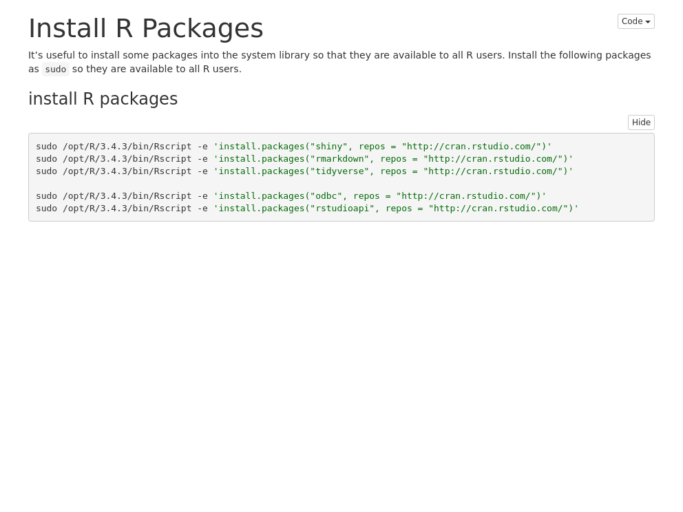
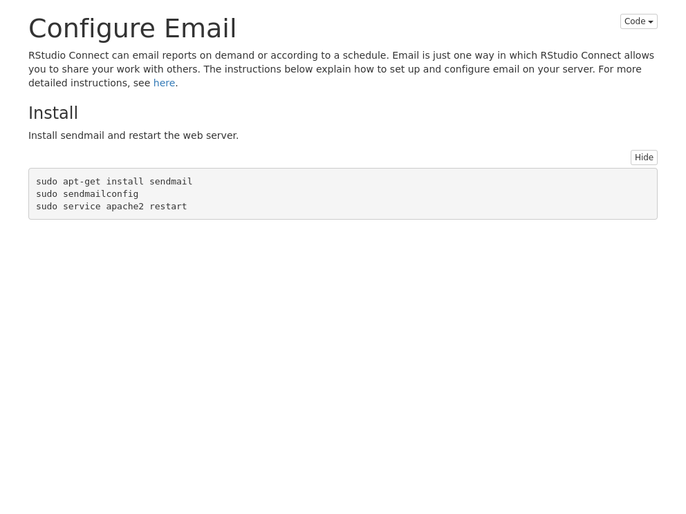
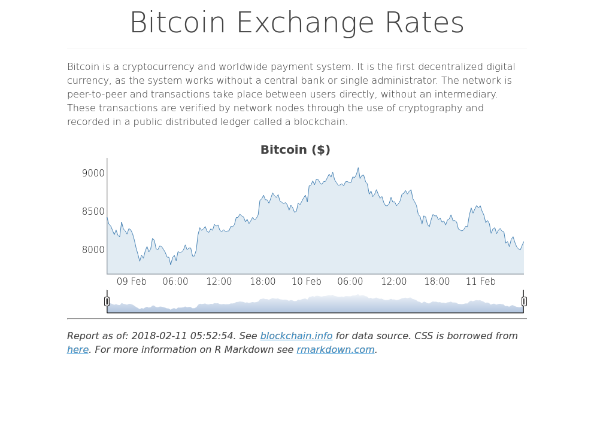
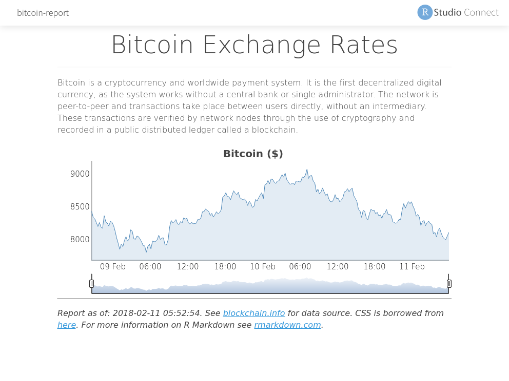
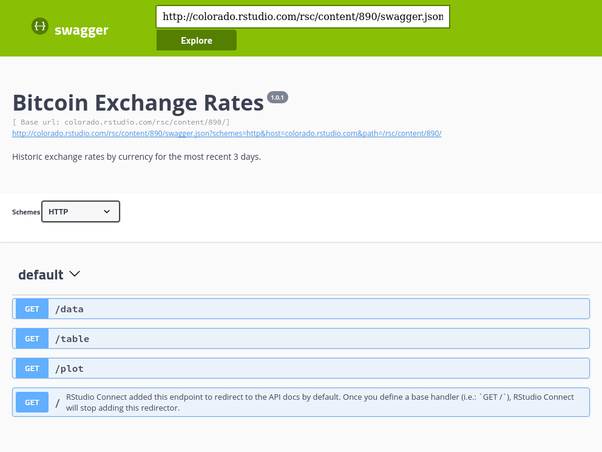

```{r cache=TRUE, include=FALSE}
library(webshot)
# Setup
webshot("http://colorado.rstudio.com/rsc/content/879/01-instance-setup.nb.html", file="01.png", cliprect="viewport") 
webshot("http://colorado.rstudio.com/rsc/content/880/02-instance-libraries.nb.html", file="02.png", cliprect="viewport")
# Datalab
webshot("http://colorado.rstudio.com/rsc/content/881/03-datalab-R.nb.html", file="03.png", cliprect="viewport")
webshot("http://colorado.rstudio.com/rsc/content/882/04-datalab-packages.nb.html", file="04.png", cliprect="viewport")
webshot("http://colorado.rstudio.com/rsc/content/883/05-datalab-rstudio.nb.html", file="05.png", cliprect="viewport")
# Integration
webshot("http://colorado.rstudio.com/rsc/content/881/03-datalab-R.nb.html", file="06.png", cliprect="viewport")
webshot("http://colorado.rstudio.com/rsc/content/885/07-integration-webserver.nb.html", file="07.png", cliprect="viewport")
webshot("http://colorado.rstudio.com/rsc/content/886/08-integration-email.nb.html", file="08.png", cliprect="viewport")
# Example
webshot("http://colorado.rstudio.com/rsc/content/888/", file="09.png", cliprect="viewport")
webshot("http://colorado.rstudio.com/rsc/bitcoin/", file="10.png", cliprect="viewport")
webshot("http://colorado.rstudio.com/rsc/content/891/bitcoin-report.html", file="11.png", cliprect="viewport")
webshot("http://colorado.rstudio.com/rsc/connect/#/apps/891/access/908", file="12.png", cliprect="viewport", delay = 10)
webshot("http://colorado.rstudio.com/rsc/content/890/__swagger__/", file="13.png", cliprect="viewport")
```

## Instance

<div style="width:100px">
Setup
[](http://colorado.rstudio.com/rsc/content/879/01-instance-setup.nb.html)
<br>
Libraries
[](http://colorado.rstudio.com/rsc/content/880/02-instance-libraries.nb.html)
</div>

## Datalab

<div style="width:100px">
R
[](http://colorado.rstudio.com/rsc/content/881/03-datalab-R.nb.html)
<br>
Packages
[](http://colorado.rstudio.com/rsc/content/882/04-datalab-packages.nb.html)
RStudio
[](http://colorado.rstudio.com/rsc/content/883/05-datalab-rstudio.nb.html)
</div>

## Integration

<div style="width:100px">
Databases
[](http://colorado.rstudio.com/rsc/content/884/06-integration-database.nb.html)
Websever
[](http://colorado.rstudio.com/rsc/content/885/07-integration-webserver.nb.html)
Email
[](http://colorado.rstudio.com/rsc/content/886/08-integration-email.nb.html)
</div>

## Example

<div style="width:100px">
App
[](http://colorado.rstudio.com/rsc/content/888/)
Website
[](http://colorado.rstudio.com/rsc/bitcoin/)
Static report
[](http://colorado.rstudio.com/rsc/content/891/bitcoin-report.html)
Parameterized report
[](http://colorado.rstudio.com/rsc/connect/#/apps/891/access/908)
API
[](http://colorado.rstudio.com/rsc/content/890/__swagger__/)


